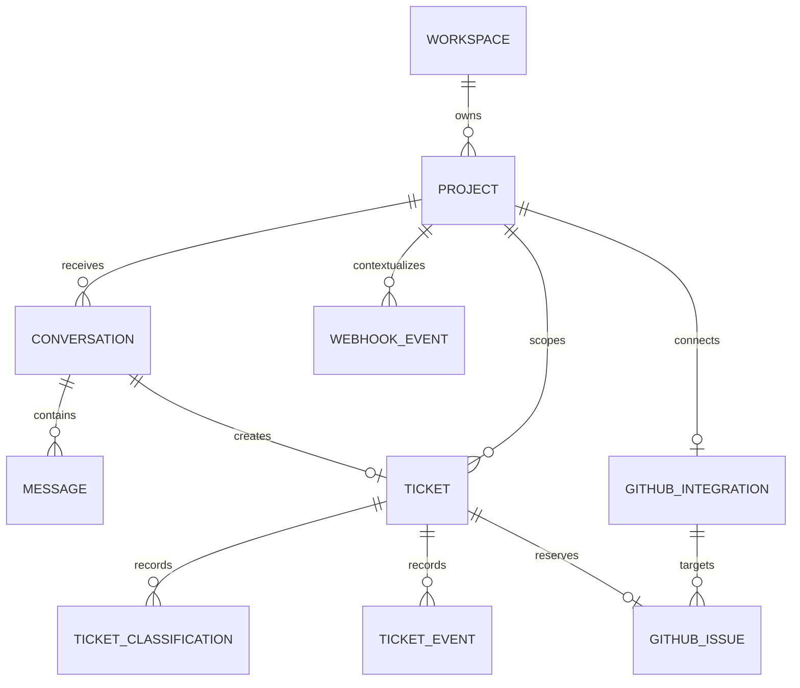

# Architecture

## Product specification

The platform serves multiple websites and applications. Each project has a public widget key and, optionally, one GitHub repository connection. A visitor can submit a message, optional name and email, and an optional visible category (`question`, `bug`, or `feature_request`). The selected category is a hint, not an authorization or final classification. The owner can see tickets, classification, status, project, conversation, linked issue, and a timeline in a protected dashboard.

MVP success is a controlled demo journey: submit a bug from the widget; find the durable ticket in the dashboard; classify it; create one issue in a disposable repository when policy allows; close and reopen that issue; observe the ticket state change. Questions and feature requests must take their intended routes without creating engineering issues. A visitor receives a ticket confirmation even when AI or GitHub is unavailable.

The first live deployment has one owner and one workspace, but every project-owned record is scoped by project and workspace. Public signup, invitations, replies to visitors, and external package publication are outside the MVP.

## System and trust boundaries

```text
External website                    Support platform (server)             External services
┌────────────────────┐             ┌──────────────────────────────┐       ┌──────────────┐
│ React support widget│── HTTPS ──▶│ Public ticket API            │       │ Jev          │
│ public project key  │             │ validation + abuse controls  │       │ Generative AI│
└────────────────────┘             │              │               │       │ GitHub App   │
                                   │              ▼               │       └──────▲───────┘
┌────────────────────┐             │ PostgreSQL: tickets, events, │              │
│ Owner dashboard    │── session ─▶│ classifications, work items  │── adapters ──┘
└────────────────────┘             │              ▲               │
                                   │ signed GitHub webhook API    │
                                   └──────────────────────────────┘
```

Browser code holds only the public project key and public API location. Session secrets, database credentials, TypeSafe API key, generative provider key, GitHub App private key, and webhook secret are server-only. Visitor text and webhook bodies are untrusted even after transport authentication. See [SECURITY.md](SECURITY.md).

## Monorepo and dependency direction

Use a pnpm workspace. `apps/web` owns Next.js routes, dashboard composition, and deployment. `apps/demo` is an independent consumer of `packages/widget`; it receives no monorepo-only access to server internals. `packages/widget` exports the React component and its public types. `packages/db` owns Drizzle schema, migrations, and project-scoped repositories. `packages/ai` owns classifier/generator contracts and provider adapters. `packages/github` owns GitHub App calls, issue mapping, and webhook verification helpers. Add a shared validation package only when both widget and server need identical public schemas; never import server-only code into the widget. UI components call application services through server routes/actions; provider SDKs and database queries do not belong in React components.

The Phase 3 React widget is `<SupportWidget projectKey="pk_..." submissionClient={client} />`, with optional position, theme, categories, title, and default-open settings. The public key identifies a project but grants no privilege. The required `SupportSubmissionClient` keeps transport outside the UI; `apps/demo` supplies an in-memory mock, and Phase 4 will add an HTTP adapter. The visible category is only a hint for later server triage. The package has no imports from applications or the database.

The widget compiles to JavaScript and TypeScript declarations. It injects bundled styles into a ShadowRoot, isolating controls from host selectors, inherited fonts, box sizing, and Tailwind configuration without an iframe or separate stylesheet. A fixed host element controls left/right placement and safe-area spacing. Light, dark, and system modes use local CSS variables; system mode follows `prefers-color-scheme`. The panel is a nonmodal dialog with Escape close, focus entry/return, labels, and announced errors. It does not trap keyboard focus from the host page.

## Domain model

| Entity | MVP responsibility and key relationships |
| --- | --- |
| Workspace | Tenant identity and display name. User and WorkspaceMember arrive with authentication later; no owner record is faked in Phase 2. |
| Project | Website identity, allowed origins, status, and unique public widget key; belongs to one workspace. Key rotation is a later application operation. |
| Conversation / Message | Visitor thread and immutable role-tagged messages; optional visitor name/email remain private on the conversation. Project matching is enforced by composite foreign keys. |
| Ticket | One workflow record per conversation, with project, status, route, optional submission idempotency key/fingerprint, and separate `SUP-<number>` display reference. |
| TicketClassification | Append-only validated decisions with source/provider/model, type, severity, policy route/recommendation, confidence, reason, and a monotonic classification number for selecting the current entry. |
| TicketEvent | Append-only, PII-free ticket timeline metadata. |
| GitHubIntegration | One project-to-repository connection with GitHub App installation and repository IDs; no credentials or tokens. |
| GitHubIssue | Pending issue intent or confirmed issue link with immutable reconciliation marker and target repository. One ticket/issue pair in MVP; a later join table can support many tickets per issue. |
| WebhookEvent | Unique provider/delivery ID and minimal processing metadata; no raw payload. |
| Work item (later) | The durable work/outbox record remains necessary for AI and issue processing, but is deferred until those workflows are implemented. Phase 2 adds no worker or queue. |



All project-owned records carry or can be joined to `project_id`; repository methods require workspace/project context. Database foreign keys and unique constraints enforce links and idempotency keys. The owner dashboard authorizes workspace membership before project-scoped reads or writes. Repository identity is verified against the project integration when processing webhooks.

## Request and state flow

1. The widget generates a submission idempotency key per user action and posts the project key, message, optional contact details, and category hint. The API applies a body limit, Zod validation, rate controls, and project/origin policy.
2. A database transaction creates Conversation, Message, Ticket, and `submitted` TicketEvent and records the idempotency key and request fingerprint unique within the project. A retry with the same key and fingerprint returns the same confirmation; the same key with different content returns a conflict. A database failure returns an error; no success is claimed.
3. Classification work runs from a durable work item. Jev proposes bounded signals; Zod validates the normalized result. Deterministic policy chooses queue and GitHub eligibility. Provider failures leave the ticket in `needs_triage` and mark work retryable without losing the report.
4. Questions route to `support`, feature requests to `product`, spam to `quarantine`, and bugs to `engineering` when validated. Account, billing, feedback, and other remain supported classifier types but use support/manual review rather than unsupported workflows. The dashboard can correct a decision, recording an event.
5. A connected bug with high confidence, safe publication content, and policy approval gets a GitHub escalation work item. A generator may improve the issue description; a deterministic template is the fallback. No contact information or raw private conversation is published.
6. Signed `issues` webhooks with `opened`, `edited`, `closed`, or `reopened` actions update the linked GitHubIssue and ticket timeline. Closing a linked engineering issue resolves the ticket unless an owner has deliberately put the ticket into another state; reopening restores `escalated` for a ticket resolved by that issue. `opened` and `edited` refresh issue metadata without overwriting support conversation content.

Ticket status is one of `needs_triage`, `queued`, `escalation_pending`, `escalated`, `resolved`, or `quarantined`. The GitHub issue intent/link has its own pending, retry, reconciliation, open, or closed state. A failed GitHub call does not invalidate or delete the ticket. The dashboard will show both statuses, so an engineering ticket can remain queued while escalation needs attention.

The Phase 2 repository implements `needs_triage → queued` and `needs_triage/queued → quarantined` through validated classification, and permits reclassification while queued or quarantined. It refuses classification from escalation or resolved states. Later services will own escalation, resolution, and reopen transitions and record corresponding events. The stored GitHub issue state uses `pending`, `retry_required`, `needs_reconciliation`, `open`, or `closed`; confirmed remote identifiers appear together.

## Idempotency and background work

Submission idempotency uses a client-generated UUID scoped to a project and a unique database constraint. Work item claims use a short lease and bounded attempts; a scheduled worker can run in the deployed environment without a resident process. Classification and issue creation are asynchronous to the public request, because serverless response completion cannot guarantee background continuation. Webhook verification and a small transactional state update run synchronously; a transient database failure returns non-2xx so GitHub can retry. Unique delivery IDs make repeated webhook requests no-ops after success.

GitHub's issue-create endpoint does not provide an application idempotency key. Before a create call, persist a stable platform marker tied to the ticket. After a clear failed response, retry with backoff. If the outcome is ambiguous (timeout or connection loss after send), mark `needs_reconciliation`, search the configured repository for the marker, and link an existing issue or require owner review before another create attempt. Never blindly repeat an ambiguous create. Uniqueness on ticket-to-issue link and GitHub issue ID protects local storage but cannot alone prevent remote duplicates.

The Postgres work table is sufficient for MVP volume and keeps ticket acceptance durable. Move to a dedicated job system when throughput, latency, scheduling precision, or operational visibility exceeds this design; record evidence before adding Redis or another service.

## GitHub design

Use a GitHub App installed only on selected repositories, with repository metadata read and Issues write permissions and `issues` webhook subscription. Store installation and repository IDs; mint installation tokens server-side. The issue mapper composes a concise title, sanitized summary, reproduction steps if present, non-identifying environment details, platform ticket reference/marker, classification, and fixed configured labels. Never let visitor text choose a repository, installation, labels outside allowlists, or an arbitrary GitHub API action. Validate webhook signature against raw bytes before parsing; reject mismatched repository/installation/issue combinations. See [DECISIONS.md](DECISIONS.md#adr-004-github-app-and-automatic-escalation) and [SECURITY.md](SECURITY.md).

## Deferred work

Later phases may add knowledge articles, AI drafted/automatic answers, customer replies, duplicate matching, one issue linked to many reports, impact counts, GitHub comment synchronization, notifications, team assignment, analytics, SLA tracking, custom themes, internationalization, a framework-agnostic widget, and additional integrations. These are design considerations, not MVP tables or packages unless a concrete implementation requires them.

## Phase boundaries and deployment

Phase 0 documented the architecture. Phase 1 established `apps/web` and `apps/demo`, root tooling, CI, and smoke tests. Phase 2 added `packages/db`, PostgreSQL 16 development/test databases, versioned migrations, seed fixtures, and project-scoped persistence methods. Phase 3 added the internal widget and mock demo consumer. Phase 4 adds ingestion; Phases 5–6 triage and dashboard; Phases 7–9 GitHub and full demo. Use a disposable GitHub repository before portfolio integration. Vercel plus managed PostgreSQL is a likely deployment shape, but provider selection and credentials are operational inputs for a later phase. Each phase updates affected documents and its handoff before stopping.
