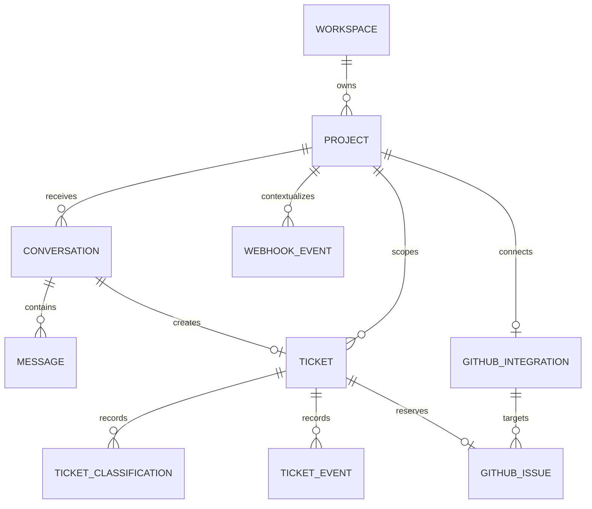

# Architecture

## Product specification

The platform serves multiple websites and applications. Each project has a public widget key and, optionally, one GitHub repository connection. A visitor can submit a message, optional name and email, and an optional visible category (`question`, `bug`, or `feature_request`). The selected category is a hint, not an authorization or final classification. The owner can see tickets, classification, status, project, conversation, linked issue, and a timeline in a protected dashboard.

MVP success is a controlled demo journey: submit a bug from the widget; find the durable ticket in the dashboard; classify it; create one issue in a disposable repository when policy allows; close and reopen that issue; observe the ticket state change. Questions and feature requests must take their intended routes without creating engineering issues. A visitor receives a ticket confirmation even when AI or GitHub is unavailable.

The first live deployment has one owner and one workspace, but every project-owned record is scoped by project and workspace. Public signup, invitations, replies to visitors, and external package publication are outside the MVP.

## System and trust boundaries

```text
External website                    Support platform (server)             External services
┌────────────────────┐             ┌──────────────────────────────┐       ┌──────────────┐
│ React support widget│── HTTPS ──▶│ Public ticket API            │       │ Jev          │
│ public project key  │             │ validation + abuse controls  │       │ Generative AI│
└────────────────────┘             │              │               │       │ GitHub App   │
                                   │              ▼               │       └──────▲───────┘
┌────────────────────┐             │ PostgreSQL: tickets, events, │              │
│ Owner dashboard    │── session ─▶│ classifications, work items  │── adapters ──┘
└────────────────────┘             │              ▲               │
                                   │ signed GitHub webhook API    │
                                   └──────────────────────────────┘
```

Browser code holds only the public project key and public API location. Session secrets, database credentials, TypeSafe API key, generative provider key, GitHub App private key, and webhook secret are server-only. Visitor text and webhook bodies are untrusted even after transport authentication. See [SECURITY.md](SECURITY.md).

## Monorepo and dependency direction

Use a pnpm workspace. `apps/web` owns Next.js routes, dashboard composition, and deployment. `apps/demo` is an independent consumer of `packages/widget`; it receives no monorepo-only access to server internals. `packages/widget` exports the React component, the HTTP submission client, and its public types. `packages/support-contracts` holds only the stable cross-boundary submission request/response/error schemas shared by the widget and the API; it imports nothing server- or database-specific. `packages/ai` owns the provider-neutral classifier contract, the Jev adapter, the fixture classifier, routing/escalation policy, and the triage service; its core never imports the database (the service takes a narrow repository port, and only its CLIs wire the real repository). `packages/auth` owns the Better Auth instance, session/membership helpers, and the owner bootstrap CLI; browser code imports only its `/client` entry. `packages/github` owns the GitHub App client, deterministic issue drafts, the privacy gate, and the escalation service; its core takes repository/tracker ports, and only its CLIs and the dashboard route wire live dependencies. `packages/db` owns Drizzle schema, migrations, and project-scoped repositories. Never import server-only code into the widget. UI components call application services through server routes/actions; provider SDKs and database queries do not belong in React components.

The Phase 3 React widget is `<SupportWidget projectKey="pk_..." submissionClient={client} />`, with optional position, theme, categories, title, and default-open settings. The public key identifies a project but grants no privilege. The required `SupportSubmissionClient` keeps transport outside the UI; `apps/demo` keeps an in-memory mock for deterministic UI work, and Phase 4 added the `HttpSupportSubmissionClient` HTTP adapter for real ingestion. The client resolves `fetch` at call time (never as a method on the instance) because native fetch throws "Illegal invocation" with a non-global receiver. The visible category is only a hint for later server triage. The package has no imports from applications or the database.

The widget compiles to JavaScript and TypeScript declarations. It injects bundled styles into a ShadowRoot, isolating controls from host selectors, inherited fonts, box sizing, and Tailwind configuration without an iframe or separate stylesheet. A fixed host element controls left/right placement and safe-area spacing. Light, dark, and system modes use local CSS variables; system mode follows `prefers-color-scheme`. The panel is a nonmodal dialog with Escape close, focus entry/return, labels, and announced errors. It does not trap keyboard focus from the host page.

## Domain model

| Entity | MVP responsibility and key relationships |
| --- | --- |
| Workspace | Tenant identity and display name. User and WorkspaceMember arrive with authentication later; no owner record is faked in Phase 2. |
| Project | Website identity, allowed origins, status, and unique public widget key; belongs to one workspace. Key rotation is a later application operation. |
| Conversation / Message | Visitor thread and immutable role-tagged messages; optional visitor name/email remain private on the conversation. Project matching is enforced by composite foreign keys. |
| Ticket | One workflow record per conversation, with project, status, route, optional submission idempotency key/fingerprint, and separate `SUP-<number>` display reference. |
| TicketClassification | Append-only validated decisions with source/provider/model, type, severity, policy route/recommendation, confidence, reason, and a monotonic classification number for selecting the current entry. |
| TicketEvent | Append-only, PII-free ticket timeline metadata. |
| GitHubIntegration | One project-to-repository connection with GitHub App installation and repository IDs; no credentials or tokens. |
| GitHubIssue | Pending issue intent or confirmed issue link with immutable reconciliation marker and target repository. One ticket/issue pair in MVP; a later join table can support many tickets per issue. |
| WebhookEvent | Unique provider/delivery ID and minimal processing metadata; no raw payload. |
| Work item (later) | The durable work/outbox record remains necessary for AI and issue processing, but is deferred until those workflows are implemented. Phase 2 adds no worker or queue. |



All project-owned records carry or can be joined to `project_id`; repository methods require workspace/project context. Database foreign keys and unique constraints enforce links and idempotency keys. The owner dashboard authorizes workspace membership before project-scoped reads or writes. Repository identity is verified against the project integration when processing webhooks.

## Request and state flow

1. The widget generates a submission idempotency key per user action and posts the project key, message, optional contact details, and category hint. The API applies a body limit, Zod validation, rate controls, and project/origin policy.
2. A database transaction creates Conversation, Message, Ticket, and `submitted` TicketEvent and records the idempotency key and request fingerprint unique within the project. A retry with the same key and fingerprint returns the same confirmation; the same key with different content returns a conflict. A database failure returns an error; no success is claimed.
3. Classification work runs from a durable work item. Jev proposes bounded signals; Zod validates the normalized result. Deterministic policy chooses queue and GitHub eligibility. Provider failures leave the ticket in `needs_triage` and mark work retryable without losing the report.
4. Questions route to `support`, feature requests to `product`, spam to `quarantine`, and bugs to `engineering` when validated. Account, billing, feedback, and other remain supported classifier types but use support/manual review rather than unsupported workflows. The dashboard can correct a decision, recording an event.
5. A connected bug with high confidence, safe publication content, and policy approval gets a GitHub escalation work item. A generator may improve the issue description; a deterministic template is the fallback. No contact information or raw private conversation is published.
6. Signed GitHub App `issues.closed` and `issues.reopened` webhooks update the persisted linked issue state and ticket timeline. Closing resolves a queued engineering ticket; reopening returns a ticket to `queued` only when the latest status decision was GitHub resolution. All other issue actions, including `opened` and `edited`, are acknowledged without mutation; no issue content or comments sync.

Ticket status is one of `needs_triage`, `queued`, `escalation_pending`, `escalated`, `resolved`, or `quarantined`. The GitHub issue intent/link has its own pending, creating, retry, reconciliation, open, or closed state. A failed GitHub call does not invalidate or delete the ticket. The dashboard will show both statuses, so an engineering ticket can remain queued while escalation needs attention.

The Phase 2 repository implements `needs_triage → queued` and `needs_triage/queued → quarantined` through validated classification, and permits reclassification while queued or quarantined. It refuses classification from escalation or resolved states. Later services will own escalation, resolution, and reopen transitions and record corresponding events. The stored GitHub issue state uses `pending`, `creating`, `retry_required`, `needs_reconciliation`, `open`, or `closed`; confirmed remote identifiers appear together.

## Public ingestion implementation (Phase 4)

```text
apps/demo → @ai-support-platform/widget → HttpSupportSubmissionClient
  → POST /api/v1/support/tickets (apps/web)
  → support-route (HTTP/validation/CORS) → support-ingestion (application service)
  → @ai-support-platform/db repository → PostgreSQL
```

The route accepts versioned JSON (`projectKey`, `category`, `message`, optional `contact`, `submissionId` UUID) with a 16 KB body cap and returns `{ ticketReference: "SUP-<number>", status: "received" }` with status 201. The route layer owns HTTP concerns only; `support-ingestion` owns project resolution, origin comparison, rate-limit consumption, fingerprinting, and the transactional write. Unknown projects return 404, disallowed browser origins 403, reused keys with changed content 409, exhausted quota 429, and persistence failures map to a 503 `SUBMISSION_FAILED` with no internal detail. Requests without an `Origin` header are treated as non-browser clients and skip origin comparison; preflight requires the `projectKey` query parameter and an allowed origin, and the response echoes only the resolved request origin (never `*`). No cookies or credentials are used, so no CSRF token applies; abuse protection is origin policy, validation, and rate limiting.

Idempotency is project-scoped: the unique `(project_id, submission_key)` ticket constraint is the final arbiter, with a pre-check fast path and a re-read after unique violations so concurrent retries converge on one ticket. The server computes a versioned SHA-256 fingerprint over category, message, and contact details; a matching key with a different fingerprint is a conflict. Successful idempotent retries return the existing reference before consuming rate-limit quota. The hourly per-project quota (120 submissions) is enforced with an atomic upsert on `submission_rate_limits`, so it holds across instances without storing client IPs. Ticket acceptance calls no AI, GitHub, or worker code.

## AI triage implementation (Phase 5)

```text
needs_triage ticket → pnpm ai:triage → triageTicket service
  → TicketClassifier (Fixture mock | JevTicketClassifier → systemOne)
  → validated result → routeForType + evaluateGitHubEscalation (policy)
  → appendClassification transaction → queued/quarantined + classified event
  → GitHub eligibility stored only (no issue call until Phase 7)
```

The classifier receives only the visitor message and optional category hint. Jev answers one `systemOne` call (`ticket_type` + `severity` choices, `triage-v1` wording); normalized confidence is the selected type label's probability, and anything outside the allowed sets or missing that probability is invalid. Deterministic policy maps question→support, feature_request→product, spam→ignore, bug→engineering, and everything else to support; escalation eligibility additionally requires confidence ≥ 0.90 (uncalibrated hypothesis in `packages/ai/src/config.ts`). Failures record `triage_failed` and leave the ticket retryable; already-triaged or non-`needs_triage` tickets are skipped so concurrent runs converge. History stays append-only with provider/model/source/confidence/reason; reclassification appends a new row and the current decision is the highest classification number. Triage runs explicitly, never inside ingestion, so acceptance is independent of Jev and no queue infrastructure was added.

## Operator dashboard (Phase 6)

```text
/login (email+password, Better Auth session cookie)
  ↓
/dashboard → projects + per-status counts (workspace-scoped)
  ↓
/dashboard/projects/[projectId]/tickets (filters + pagination, URL-addressable)
  ↓
/dashboard/projects/[projectId]/tickets/[ticketId] (report, AI, history, timeline, override, actions)
  ↓
POST /api/dashboard/tickets/[ticketId]/{retriage,status,override}
  → session + membership + transition/Zod checks → repository → revalidate
```

Reads are Next.js server components over scoped repository queries; mutations are JSON route handlers (chosen over server actions for explicit HTTP semantics and testability) with cookie sessions, Origin-vs-host CSRF checks, Zod bodies, and safe `{ok, error}` results. Every query resolves project→workspace and asserts membership; unknown or foreign IDs return 404 without leaking existence. Contact details render only on authorized detail pages, never in lists. Dashboard routes are `force-dynamic` so authenticated pages are never statically cached.

Human review model: AI history is append-only and never rewritten. Overrides land in `ticket_overrides` with author, changed route/status/escalation, and reason, while applying route/status to workflow state and recording `rerouted`/`released_from_quarantine` events. Re-triage appends a new attempt (`retriage_requested` first); resolve/reopen move through `canTransition` with `resolved`/`reopened` events. No `needs_review` status was added: below-floor confidence (`< 0.50`) renders a "Needs review" badge, and failed triage shows as untriaged with its failure event. Escalation states stay exclusive to the future GitHub phase.

Authentication is Better Auth email/password per ADR-002 (no OAuth, no custom password code): `user`/`session`/`account`/`verification` tables plus `workspace_members(user, workspace, role)`; the seeded owner bootstraps via `auth:bootstrap`. Public signup endpoints return 404 unless `AUTH_ALLOW_SIGNUP=true`; the ingestion API is unaffected.

## GitHub escalation implementation (Phase 7)

```text
queued bug (eligible) → dashboard preview → operator confirm
  → escalateTicketToGitHub service
  → policy (effective AI + override precedence) → privacy gate → draft
  → reserve intent (opaque marker) → atomic creating claim
  → verify repository identity + trusted App-bot reconciliation → create via App token
  → guarded confirmation (open) + github_issue_created → ticket stays queued
  → dashboard shows linked issue
```

A `creating` issue-intent state is claimed transactionally before any GitHub call. A second request cannot create while that claim exists; a crashed claimant needs operator reconciliation. Confirmation refuses to replace a remote ID. A `needs_reconciliation` retry searches for an exact standalone marker from the configured App bot on a non-PR issue in the verified repository and cannot create on a miss. Clear provider rejections can move to `retry_required`. The marker includes a digest of the private ticket UUID rather than only its sequential reference.

The GitHub App (Issues read/write, Metadata read-only) mints short-lived installation tokens inside the official `@octokit/app` SDK; tokens and private keys never touch the database or browser. Issue content is deterministic: a bounded title, screened visitor report in an adaptive Markdown code fence, opaque `<!-- ai-support-ticket:SUP-n:<digest> -->` marker, and allowlisted labels. The claimed attempt verifies repository identity and searches recent issues for an exact marker from this App bot on a non-PR issue. Ambiguous outcomes stay in `needs_reconciliation`; clear GitHub rejections can move to `retry_required`; successes confirm `open` with remote ID/number/URL. Human decline wins; already-linked tickets return their linkage. Ticket status is unchanged by creation.

## Inbound GitHub synchronization (Phase 8)

```text
Visitor → Support Widget → Ingestion → Ticket → AI Triage → Human Review
  → GitHub Escalation → GitHub Issue
GitHub Issue → signed POST /api/webhooks/github → raw-byte HMAC verification
  → unique WebhookEvent delivery → repository + installation + issue linkage
  → GitHubIssue open/closed → ticket workflow + TicketEvent → dashboard
```

`packages/github` owns the minimal event schema and synchronization policy; the route owns bounded raw-body reading, headers, signature, and HTTP responses. `packages/db` provides a transaction callback over the existing `webhook_events`, `github_issues`, `tickets`, and `ticket_events` tables. Inserting the unique delivery row before processing serializes concurrent copies. A transaction failure rolls back the row and all domain changes; terminal processed/ignored rows make redelivery a no-op. Remote identity uses repository ID plus issue ID, then verifies issue number, App installation ID, active integration, and the project-matching foreign-key chain. A correlation marker alone never authorizes inbound changes.

A state change produces `github_issue_closed`/`github_issue_reopened`; automatic ticket transitions additionally produce `ticket_resolved_from_github`/`ticket_reopened_from_github`. The latest status-changing event by monotonic `event_number` provides resolution provenance; review-only `rerouted` events do not change that provenance. A human reopen after a GitHub close remains effective until a new remote state transition. Repeated close events under new delivery IDs do not re-resolve it. Out-of-order distinct events may still regress remote state because no provider timestamp is persisted or fresh GitHub fetch is made; reconcile manually if observed. Payload size is capped at 1 MiB and GitHub expects a response within 10 seconds, so monitor latency and move to durable async processing only if measured load requires it.

## Demo journey completion (Phase 9)

The journey was validated live against a disposable repository (see the [live journey review](docs/reviews/phase-09-live-journey-test-review.md)). Phase 9 closed the operational gaps it exposed:

- **Provenance gate:** preview and escalation require a `model` or `manual` classification, or an owner override recommending escalation. A `fixture` or `fallback` decision alone is not evidence that a report is a real bug. Only fully synthetic runs (the non-production `GITHUB_ESCALATION_MOCK=1` dashboard, the mock `github:escalate` CLI, and tests) pass `allowFixtureClassifications`; real App paths never do.
- **Reconcile check:** a dashboard create on an `unknown` (`needs_reconciliation`) link now runs the service's reconcile-only path; previously the route returned the preview and the check never ran. Previews no longer construct the GitHub App client, so they work without App credentials; creation still fails closed without them.
- **Audit clarity:** labels missing from the repository record `github_labels_omitted` instead of a second `github_escalation_requested`. Processed webhook deliveries record the verified link's `project_id`; ignored and unknown deliveries keep it null.
- **Recovery:** [docs/GITHUB_RECOVERY.md](docs/GITHUB_RECOVERY.md) covers unknown outcomes, interrupted `creating` claims, GitHub list lag, missed or failed deliveries, and accidental publication.

## Production hardening (Phase 10)

- **Dashboard mutations** require a same-origin `Origin` header in addition to the session and membership checks, so forged cross-site requests fail even if the cookie policy changes. Publishing (GitHub create/reconcile) and human review overrides are owner-only; members can view, preview, re-triage, and resolve/reopen. Members see no publishing controls.
- **Post-login redirects** accept only same-origin `/dashboard` paths; backslash, tab, encoded-slash, control-character, and oversized variants fall back to `/dashboard` (one helper shared by server and client).
- **Webhook ordering:** `github_issues.remote_updated_at` (migration `0006`) stores the newest GitHub `issue.updated_at` applied. A delivery older than it is ignored as `stale_event`; a newer event for the current state only advances the watermark. Equal (one-second) timestamps fall back to arrival order.
- **Early close:** after a link is confirmed, escalation reads the issue's current state from GitHub and applies it through the same `applyIssueEvent` policy and row locks (`withGitHubIssueSync`, no delivery row). A close delivered before the link existed is no longer lost. The read is best effort; webhooks remain the primary path.
- **Connections:** long-running servers share one `pg` pool per process (`getSharedDatabase`, sized by `DATABASE_POOL_MAX`, default 5); CLIs own and close their own pools.
- **Startup guard:** `apps/web/instrumentation.ts` refuses to serve in production with a missing, example, short, or low-variety `BETTER_AUTH_SECRET`, a non-HTTPS `BETTER_AUTH_URL`, a short `GITHUB_WEBHOOK_SECRET`, `GITHUB_ESCALATION_MOCK`, or `AUTH_ALLOW_SIGNUP=true` (email verification is not configured). Platform responses carry anti-framing, `nosniff`, referrer, and permissions headers, plus HSTS in production.
- **Retention:** `pnpm db:retention` (dry run unless `--apply`) erases visitor name/email from tickets resolved over 180 days ago and deletes processed/ignored webhook records over 90 days old (minimum 7, beyond GitHub's redelivery window).

## Idempotency and background work

Submission idempotency uses a client-generated UUID scoped to a project and a unique database constraint. Work item claims use a short lease and bounded attempts; a scheduled worker can run in the deployed environment without a resident process. Classification and issue creation are asynchronous to the public request, because serverless response completion cannot guarantee background continuation. Webhook verification and a small transactional state update run synchronously; a transient database failure returns 503 and rolls back. GitHub does not automatically redeliver failed requests, so an operator must redeliver or later add a scheduled recovery job. Unique delivery IDs make repeated requests no-ops after success.

GitHub's issue-create endpoint does not provide an application idempotency key. Before a create call, persist a stable opaque marker and claim the issue intent as `creating`. Clear response rejections can be retried after repair. If the outcome is ambiguous (timeout or connection loss after send), mark `needs_reconciliation`, search the verified repository for a trusted App-authored marker, and link an existing issue or require owner review; an automated retry cannot create on a miss. Never blindly repeat an ambiguous create. The exclusive claim and guarded confirmation protect the one-issue invariant.

The Postgres work table is sufficient for MVP volume and keeps ticket acceptance durable. Move to a dedicated job system when throughput, latency, scheduling precision, or operational visibility exceeds this design; record evidence before adding Redis or another service.

## GitHub design

Use a GitHub App installed only on selected repositories, with repository metadata read and Issues write permissions and `issues` webhook subscription. Store installation and repository IDs; mint installation tokens server-side. The issue mapper composes a concise title, screened report in an adaptive Markdown code fence, non-identifying context, an opaque platform ticket marker, classification, and fixed configured labels. Never let visitor text choose a repository, installation, labels outside allowlists, or an arbitrary GitHub API action. Validate webhook signature against raw bytes before parsing; reject mismatched repository/installation/issue combinations. See [DECISIONS.md](DECISIONS.md#adr-004-github-app-and-automatic-escalation) and [SECURITY.md](SECURITY.md).

## Deferred work

Later phases may add knowledge articles, AI drafted/automatic answers, customer replies, duplicate matching, one issue linked to many reports, impact counts, GitHub comment synchronization, notifications, team assignment, analytics, SLA tracking, custom themes, internationalization, a framework-agnostic widget, and additional integrations. These are design considerations, not MVP tables or packages unless a concrete implementation requires them.

## Phase boundaries and deployment

Phase 0 documented the architecture. Phase 1 established `apps/web` and `apps/demo`, root tooling, CI, and smoke tests. Phase 2 added `packages/db`, PostgreSQL 16 development/test databases, versioned migrations, seed fixtures, and project-scoped persistence methods. Phase 3 added the internal widget and mock demo consumer. Phase 4 added the public ingestion vertical slice (`support-contracts`, HTTP client, API route, transactional persistence, origin/rate controls); Phase 5 added provider-neutral AI triage over persisted tickets; Phase 6 added the authenticated operator dashboard with human review; Phase 7 added operator-confirmed GitHub escalation with privacy gating and reconcile-first idempotency; Phase 8 added signed webhook sync; Phase 9 validated the complete demo journey live and closed its operational gaps; Phase 10 hardened the platform for production (see above). Phases 11–12 cover external widget package validation and npm publication. Use a disposable GitHub repository before portfolio integration. Vercel plus managed PostgreSQL is a likely deployment shape, but provider selection and credentials are operational inputs for a later phase. Each phase updates affected documents and its handoff before stopping.
