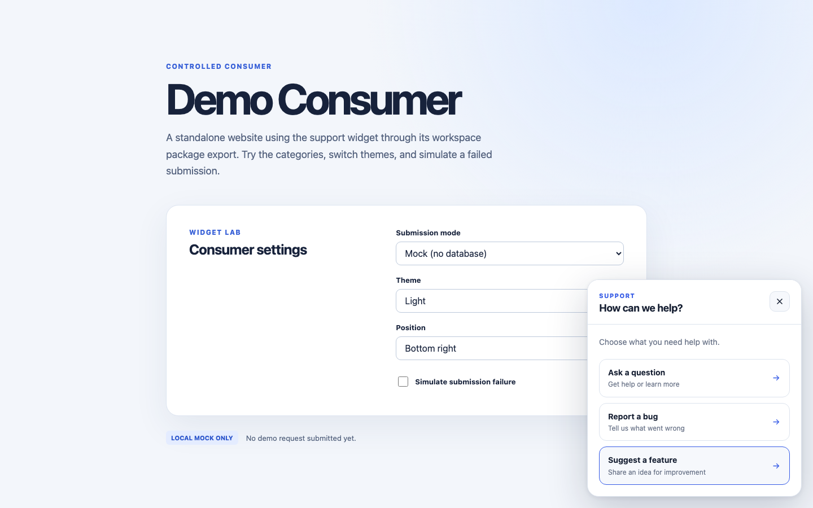

# AI Support Platform

> An embeddable support widget that turns website feedback into reviewable tickets and connects engineering bugs to GitHub.

[](https://github.com/andrewbaisden/ai-support-platform/actions/workflows/ci.yml)
[](docs/ROADMAP.md)
[](#license)



AI Support Platform combines a reusable React widget, a private operator dashboard, AI-assisted triage, and a GitHub App integration. Visitors can ask questions, report bugs, or suggest features without leaving a website. The platform stores each request before any external service runs, then helps an operator review and route it. Eligible bugs can become GitHub issues after explicit confirmation; signed GitHub webhooks bring issue close and reopen state back to the ticket.

The screenshot shows the real widget in the included demo app, using its local mock submission mode. The widget package is currently internal to this monorepo and has **not** been published to npm.

## What it does

- Embeds a React support widget with Shadow DOM styles, theme and position options, and no consumer Tailwind setup.
- Stores conversations and tickets in PostgreSQL with idempotent submission and project-scoped access controls.
- Uses a fixture classifier locally or opt-in Jev classification to recommend ticket type and severity; deterministic policy owns routing.
- Gives operators an authenticated dashboard for ticket history, review decisions, and workflow changes.
- Previews privacy-screened GitHub issues and creates them only after operator confirmation.
- Verifies signed GitHub webhooks and synchronizes linked issue close/reopen state with the ticket.

```text
Visitor → Widget → Ticket → Triage → Human review → GitHub issue
                                                   ↘ signed webhook → Ticket update
```

AI classification does not send automatic replies to visitors. GitHub escalation is not automatic.

## Getting started

Use Node.js 24, pnpm 11.5.3, and Docker with PostgreSQL 16 (or equivalent local PostgreSQL URLs). From the repository root:

```sh
pnpm install --frozen-lockfile
cp .env.example .env
pnpm db:up
pnpm db:migrate
pnpm db:seed
pnpm dev
```

Before seeding, set `SEED_OWNER_EMAIL` and `SEED_OWNER_PASSWORD` in the ignored `.env` file if you want to sign in to the dashboard. The example Better Auth secret and owner password are **local-only**; replace them with unique values before exposing the app through a public endpoint. Never commit `.env` or provider credentials.

Open the platform at `http://127.0.0.1:3000` and the demo website at `http://127.0.0.1:3001`. The demo starts in mock mode and can be used without database credentials; real mode sends requests to the local API. See [development setup](docs/DEVELOPMENT.md) for environment options, service setup, and verification commands.

## Using the widget in this monorepo

The included demo imports the workspace package through its public export. A consumer supplies a public project key and a submission client:

```tsx
import {
  HttpSupportSubmissionClient,
  SupportWidget,
} from "@ai-support-platform/widget";

const submissionClient = new HttpSupportSubmissionClient({
  apiBaseUrl: "https://your-platform.example",
});

export function Support() {
  return (
    <SupportWidget
      projectKey="your-public-project-key"
      submissionClient={submissionClient}
      theme="system"
      position="bottom-right"
    />
  );
}
```

The project key identifies a project; it is not a secret or an authentication token. Database, Jev, GitHub, and webhook secrets remain server-side. External installation instructions will follow package validation and publication.

## Status and releases

The core submission, triage, human review, GitHub escalation, and webhook synchronization flow is implemented and covered by local tests. Live GitHub webhook validation against a disposable repository has not yet run. There is no published release or npm package. [The roadmap](docs/ROADMAP.md) tracks the remaining validation and publication work.

## Documentation

- [Development setup and commands](docs/DEVELOPMENT.md)
- [Product specification](docs/PRODUCT_SPEC.md) and [roadmap](docs/ROADMAP.md)
- [Architecture](ARCHITECTURE.md) and [architecture decisions](DECISIONS.md)
- [AI engineering](AI_ENGINEERING.md), [security](SECURITY.md), and [testing](TESTING.md)
- [Phase handoffs](docs/handoffs/) and [Phase 8 review](docs/reviews/phase-08-grok-review.md)

## Responsible use

Visitor messages and contact details are private support data. The system uses AI for bounded recommendations, keeps human decisions separate from classification history, and requires human confirmation before publishing an issue to GitHub. Confidence scores are not calibrated probabilities. Review issue previews before publication and use synthetic data for live integration tests. See [SECURITY.md](SECURITY.md) for trust boundaries and [AI_ENGINEERING.md](AI_ENGINEERING.md) for model limits.

## License

No license has been selected or included yet. Reuse terms are unspecified; contact the owner before copying, modifying, or redistributing code. A license decision is required before external package publication.
